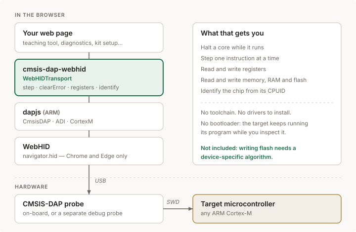

# cmsis-dap-webhid

Use **CMSIS-DAP** debug probes from a web page, over **WebHID**.

Halt a running ARM Cortex-M, single-step it, read its registers and dump its
memory — from a browser tab, with no toolchain and no drivers installed.

**Try it right now, nothing to install:**
[**debugger**](https://dcuartielles.github.io/cmsis-dap-webhid/examples/debugger/)
· [**flasher**](https://dcuartielles.github.io/cmsis-dap-webhid/examples/flasher/)
— Chrome or Edge, with a CMSIS-DAP board plugged in.



## What it's for

A CMSIS-DAP probe is a small piece of hardware that speaks **SWD** to the debug
port of an ARM chip. Many boards have one built in, so the debugger is already
sitting on the desk. What has been missing is a way to reach it without
installing anything: normally you need OpenOCD, pyOCD or a vendor IDE, each
with its own toolchain, its own drivers and its own bad afternoon.

This library removes that step. The browser becomes the debugger.

That matters in a few concrete situations:

- **Teaching.** Show a class what a program counter *is* by stepping one
  instruction at a time and watching it move. Send a link, not an install
  guide. No lab machine to prepare, no admin rights, nothing left behind.
- **Diagnostics in the field.** A board misbehaves at a customer site. Open a
  page, halt the core, read the fault registers and see where it stopped —
  on whatever laptop happens to be there.
- **Hardware kits and products.** Ship a web page that checks a board is alive,
  reads its serial number out of flash, or verifies it was programmed
  correctly. Buyers do not install anything.
- **Test rigs and production lines.** A browser tab as the operator interface,
  with the debug access built into it.
- **Building better tools.** This is a foundation. A full web debugger — with
  breakpoints, a memory viewer, source-level stepping — can be built on top.

The target keeps running its own program the whole time. This is **not** a
bootloader upload: nothing is overwritten, nothing needs to be prepared on the
chip. Debug access is a separate port that is always there.

## How the pieces fit

Reading the diagram from the top down:

| Layer | What it does |
|---|---|
| **Your page** | Whatever you are building: a lesson, a test jig, a diagnostic tool |
| **cmsis-dap-webhid** | This library. Supplies the transport dapjs lacks, plus the debug helpers you need right after it |
| **dapjs** | ARM's own library. Speaks the CMSIS-DAP command protocol and the ARM debug interface on top of it |
| **WebHID** | The browser API that lets a page talk to a USB HID device, once the user grants permission |
| **CMSIS-DAP probe** | The hardware, on the board or separate. Turns USB packets into SWD signalling |
| **Target chip** | Any ARM Cortex-M, reached through its debug port |

The user grants access to the probe once, from a click. From then on the page
can reach it again without asking.

## Why this exists

[dapjs](https://github.com/ARMmbed/dapjs), ARM's own library, ships transports
for Node (node-hid, usb) and for the browser over **WebUSB** — but **CMSIS-DAP
v1 probes enumerate as HID devices**. On Windows and macOS the operating system
claims HID devices exclusively, so WebUSB cannot open them, and there is no
WebHID transport in dapjs. The result is that the most common kind of probe
cannot be reached from a browser at all.

This is that missing transport, written against the real wire protocol —
64-byte reports in both directions, report ID 0 — plus the handful of Cortex-M
helpers you need the moment the link comes up.

```js
import { requestTransport, identify, registers, trace, hex } from 'cmsis-dap-webhid';
import { CortexM } from 'dapjs';

// Must come from a click: WebHID requires a user gesture.
const transport = await requestTransport();
const target = new CortexM(transport);
await target.connect();

console.log(await identify(target));      // { core: 'Cortex-M4', ... }

await target.halt();
console.log(await registers(target));     // { PC: ..., SP: ..., LR: ... }
console.log((await trace(target, 10)).map(v => hex(v)));
await target.resume();
```

## Install

```bash
npm install cmsis-dap-webhid dapjs
```

Or use it straight from a page, no build step:

```html
<script type="module">
  import { requestTransport } from 'https://esm.sh/cmsis-dap-webhid';
  import { CortexM } from 'https://esm.sh/dapjs';
</script>
```

**Requires Chrome or Edge.** Firefox and Safari do not implement WebHID, and
have said they do not intend to. The page must also be served over HTTPS or
from `localhost`.

## What you get

### Transport

| | |
|---|---|
| `WebHIDTransport(device, options)` | The dapjs transport. Wrap a `HIDDevice` |
| `requestTransport(options)` | Ask the user for a probe, return it open |
| `getTransports(options)` | Transports for already-granted probes |
| `KNOWN_PROBES` | Vendor IDs of common probes, as a device filter |

### Debug helpers

| | |
|---|---|
| `step(target)` | Execute one instruction. **dapjs does not expose this** |
| `trace(target, n)` | Step `n` times, return the PC at each stop |
| `state(target)` | Halted? sleeping? locked up? |
| `registers(target)` | All core registers at once |
| `identify(target)` | Which Cortex-M this is, from CPUID |
| `clearError(target)` | **Recover from a stuck transfer.** See below |
| `readSafe(target, addr)` | Read, returning `null` for unmapped addresses |
| `probeMemory(target, addrs)` | Find where memory actually is |

### Writing flash

| | |
|---|---|
| `parseFLM(buffer)` | Read a vendor `.FLM`: geometry, code and entry points |
| `FlashProgrammer(target, algo, opts)` | Run that algorithm on the chip |
| `.program(addr, bytes, opts)` | Erase the sectors and write the image |
| `.verify(addr, bytes)` | Read back and compare |
| `.eraseSector(addr)` / `.eraseAll()` | Erase without writing |

### Vendor packs

| | |
|---|---|
| `fetchAlgorithm({pack, device})` | Fetch the right algorithm for a chip, in memory |
| `openPackFile(blob)` / `openRemotePack(url)` | Read a pack without unpacking it |
| `selectAlgorithm(archive, {device})` | Pick the algorithm a chip declares |
| `parseDescriptor(xml)` | Devices, memories and algorithms from a `.pdsc` |

## Two things worth knowing

**A failed transfer leaves the DAP stuck.** Reading an unmapped address returns
a `FAULT`, and from then on *every* access fails until the error is cleared
through the ABORT register. Without `clearError()`, a single bad read means
reloading the page. `readSafe()` handles it for you.

**Addresses from generic OpenOCD configs are not always right.** On the Renesas
RA4M1, `0x1ffe0000` appears as the work area and faults; usable RAM starts at
`0x20000000`. `probeMemory()` exists to find out rather than assume.

## Getting a permission

WebHID only prompts from a user gesture, so `requestTransport()` has to be
called from a click. Once granted, the permission persists for that origin and
`getTransports()` returns the probe without asking again.

Note that **a board in bootloader mode is a different USB device** and needs its
own permission.

## Tested with

- **Arduino Uno R4 WiFi** (Renesas RA4M1, Cortex-M4) — its on-board CMSIS-DAP
  reports itself as `TinyUSB CMSIS-DAP`, 64-byte reports, report ID 0.

It should work with any CMSIS-DAP v1 probe. Reports of what does and does not
work are welcome.

## Writing flash

Nobody reimplements flash drivers. Every silicon vendor ships compiled
`Init` / `EraseSector` / `ProgramPage` routines in a `.FLM` file, and debuggers
copy those into the chip's RAM and let the chip program itself. OpenOCD and
pyOCD both work this way, and so does this.

```js
import { parseFLM, FlashProgrammer } from 'cmsis-dap-webhid';

const algorithm = parseFLM(await file.arrayBuffer());   // the vendor's .FLM
const flash = new FlashProgrammer(target, algorithm, {
  ramAddress: 0x20000000,        // where this chip's RAM starts
  ramSize: 0x8000,
});

await flash.program(0x0, firmware, {
  onProgress: ({ phase, done, total }) => console.log(phase, done, '/', total),
});
await flash.verify(0x0, firmware);
await target.reset();
```

### Getting the algorithm

**You supply the algorithm; none is bundled.** Vendor `.FLM` files come with
vendor licences — the Renesas RA4M1 one, for instance, is Apache-2.0 from ARM
but carries a Renesas notice limiting use to Renesas parts. That is a
field-of-use restriction no free licence can pass on, so redistributing it here
is not an option.

What this library can do is fetch it for you, straight from the vendor's own
CMSIS pack, so the file reaches you from them under their terms. Name the chip
and you get the right algorithm **and** the RAM settings it needs:

```js
import { fetchAlgorithm, parseFLM, FlashProgrammer } from 'cmsis-dap-webhid';

const { data, ram, device } = await fetchAlgorithm({
  pack: 'Renesas.RA_DFP',
  device: 'R7FA4M1AB3CFM',      // a full part number works too
});

const flash = new FlashProgrammer(target, parseFLM(data), {
  ramAddress: ram.start,        // read off the pack descriptor, not guessed
  ramSize: ram.size,
});
```

Nothing touches the filesystem: the bytes come back in memory. The same from
the command line, if you would rather have the file:

```bash
node tools/fetch-flm.mjs --search renesas
node tools/fetch-flm.mjs --pack Renesas.RA_DFP --device R7FA4M1AB
node tools/fetch-flm.mjs --pack Renesas.RA_DFP --device R7FA4M1AB --stdout
```

**A `.pack` is a zip, and it is read in place.** Range requests fetch the tail
to find the central directory, then only the bytes of the entry wanted: that
Renesas pack is 88 MB and the algorithm inside is 23 KB, so 23 KB travel, in
about two seconds. Extracted data is checked against its CRC.

### In a browser

The code runs in a browser unchanged — but **the vendor servers refuse
cross-origin requests**. Measured from a GitHub Pages origin: `keil.com`, its
Azure mirror, `packs.download.arm.com` and `www2.renesas.eu` all fail CORS. The
library is ready; the hosts are not, and a public CORS proxy is a poor thing to
route firmware through.

So in a browser, hand it the pack instead. Download it normally — that is
ordinary navigation, not a fetch — and drop the `.pack` on the page:

```js
const archive = await openPackFile(file);           // a File or Blob
const { data, ram } = await selectAlgorithm(archive, { device: 'R7FA4M1AB' });
```

Only the parts needed are read out of it, so a 90 MB pack does not become 90 MB
of memory. The flasher example accepts either a `.FLM` or a whole `.pack`.

Two things the `.FLM` does not tell you, because they are not in it: **where
the chip's RAM is**, which you pass as `ramAddress`, and **what to write**,
which must be a raw `.bin` rather than a `.hex` or `.elf`.

## Examples

Both are self-contained pages, served from this repository. Nothing is
uploaded anywhere: they talk to the probe from your own machine.

| | |
|---|---|
| [**debugger**](https://dcuartielles.github.io/cmsis-dap-webhid/examples/debugger/) | Connect a probe, halt the core, step through instructions, dump memory |
| [**flasher**](https://dcuartielles.github.io/cmsis-dap-webhid/examples/flasher/) | Feed it a `.FLM` and a `.bin`, and it writes one to the other |

Click *Connect probe* and pick your device; the browser asks once per site.
The source is in `examples/`. To run them locally, serve over HTTPS or
`localhost` — WebHID refuses to work otherwise.

## Author

David J. Cuartielles Ruiz

## Licence

**GPL-3.0-or-later.** See [LICENSE](LICENSE).

If you use this library, your project must also be released under the GPL.
That is deliberate: improvements to tooling like this are worth more shared.

`dapjs` is a peer dependency, licensed separately by ARM under Apache-2.0.
Apache-2.0 is compatible with GPLv3, so combining them is fine — but note it is
**not** compatible with GPLv2, which is why this is v3.
